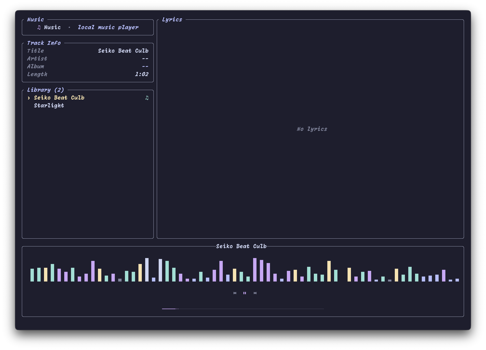

<div align="center">

# 🎵 Nusic

**在终端里优雅地播放本地音乐**

[](https://github.com/OriginCoderPulse/Nusic/releases/tag/v0.1.3)
[](LICENSE)
[](https://www.rust-lang.org/)
[](#-安装)

[English](./README.md) · [简体中文](#-nusic)

</div>

---

## ✨ 功能亮点

| | |
|---|---|
| 🖥️ **终端界面** | 基于 [ratatui](https://github.com/ratatui/ratatui)，圆角面板、自适应布局、实时频谱 |
| 🎧 **本地播放** | 支持 MP3、FLAC、OGG、Opus、M4A、AAC、WAV、AIFF 等，由 Symphonia 解码 |
| 📂 **自动扫描** | 监听 `~/.music` 目录，拖入文件即可即时出现在曲库 |
| 🔀 **智能队列** | 从当前曲目开始随机、列表循环 / 单曲循环 |
| 🔊 **系统音量** | 快捷键直接调节 macOS / Linux 系统音量 |
| 📝 **歌词同步** | 同目录 `.lrc` 文件自动加载，随播放滚动高亮 |
| 🏷️ **元数据** | 读取内嵌标签；缺失时从 `艺术家 - 标题` 文件名解析 |

---

## 📸 界面预览

<p align="center">
  
</p>

随时按 **`K`** 打开应用内快捷键帮助。

---

## 📦 安装

### Homebrew（macOS / Linux）

```bash
brew tap OriginCoderPulse/HomeBrew-Tap
brew install nusic
```

### 从源码编译

需要 **Rust 1.75+**。

```bash
git clone https://github.com/OriginCoderPulse/Nusic.git
cd Nusic
cargo install --path .
```

---

## 🚀 快速上手

1. **放入音乐** — 将音频文件复制到 `~/.music`（首次启动会自动创建）。
2. **启动** — 在终端运行 `nusic`。
3. **播放** — 用 `j` / `k` 选择曲目，按 `Enter` 或 `Space` 播放。
4. **打开目录** — 按 `o` 在 Finder / 文件管理器中打开音乐文件夹。

> 💡 **提示：** 部分下载来源的文件没有内嵌标签（例如某些平台的 M4A），程序会从 `艺术家 - 标题.ext` 格式的文件名解析信息。

---

## ⌨️ 快捷键

### 播放控制

| 按键 | 功能 |
|------|------|
| `Space` | 播放 / 暂停 |
| `Enter` | 播放选中曲目 |
| `n` / `]` | 下一首 |
| `p` / `[` | 上一首 |

### 列表导航

| 按键 | 功能 |
|------|------|
| `j` / `↓` | 向下移动选中项 |
| `k` / `↑` | 向上移动选中项 |
| `Ctrl+u` / `Ctrl+d` | 半页滚动 |
| `PgUp` / `PgDn` | 跳转 10 条 |
| `Home` / `End` | 第一首 / 最后一首 |

### 模式与音量

| 按键 | 功能 |
|------|------|
| `s` | 开关随机（从当前曲目开始洗牌） |
| `r` | 循环模式：关 → 列表循环 → 单曲循环 |
| `h` `l` `←` `→` `,` `.` | 降低 / 提高系统音量 |
| `+` / `-` | 提高 / 降低系统音量 |

### 其他

| 按键 | 功能 |
|------|------|
| `/` | 搜索曲库 |
| `o` | 打开音乐目录 |
| `K` | 显示 / 隐藏帮助 |
| `q` / `Esc` / `Ctrl+s` | 退出 |

---

## 🔀 播放模式说明

| 模式 | 行为 |
|------|------|
| **随机关** | 按曲库顺序播放；上一首 / 下一首沿列表线性导航（列表循环开启时首尾相接） |
| **随机开** | 以**当前正在播放的曲目**为起点重新洗牌，不会跳走 |
| **循环关** | 播放到列表末尾停止 |
| **列表循环** | 整个播放列表循环 |
| **单曲循环** | 重复当前曲目（会自动关闭随机） |

---

## 🏷️ 元数据与歌词

### 标签读取

通过 Symphonia 读取 ID3、Vorbis、MP4/iTunes 等内嵌标签。缺失字段显示为 **`--`**，而非占位文案。

### 文件名兜底

无标签时解析文件名：

```
张碧晨 - 光的方向 (Live).m4a  →  艺术家: 张碧晨  ·  标题: 光的方向 (Live)
```

### 歌词（`.lrc`）

在与音频文件同目录放置同名 `.lrc` 文件：

```
~/.music/
├── 张碧晨 - 光的方向 (Live).m4a
└── 张碧晨 - 光的方向 (Live).lrc
```

---

## 🎵 支持格式

`mp3` · `flac` · `ogg` · `opus` · `m4a` · `m4p` · `aac` · `wav` · `aiff` · `aif`

---

## 🛠️ 开发

```bash
cargo build          # 调试构建
cargo run            # 直接运行
cargo build --release
```

项目结构：

```
src/
├── app.rs            # 应用状态与事件循环
├── audio/            # rodio + symphonia 解码
├── library/          # 扫描、元数据、歌词、文件监听
├── player/           # 队列、随机、循环
├── system_volume.rs  # macOS / Linux 音量控制
└── ui/               # ratatui 布局与组件
```

---

## 📄 许可证

[MIT](LICENSE) © OriginCoderPulse

---

<div align="center">

**在终端里享受你的音乐** 🎶

[反馈问题](https://github.com/OriginCoderPulse/Nusic/issues) · [English docs](./README.md)

</div>
